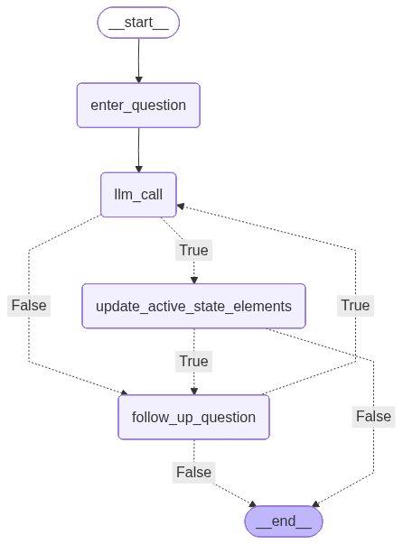

# Epistemic RAG Agent

An answerability-aware hybrid RAG agent combining dense and lexical retrieval with fusion, reranking, and clarification loops.

### A History Professor in the vein of Gibbon's *The History of the Decline and Fall of the Roman Empire*

  Implemented within the domain of Roman history from the perspective of Edward Gibbon's seminal work, *The History of the Decline and Fall of the Roman Empire*.  "Chat" with information exclusively synthesized from the source text and interact with Roman History, as Gibbon saw it. 

## Source Material and Architecture

The text corpus is derived from [*The History of the Decline and Fall of the Roman Empire* by Edward Gibbon](https://www.gutenberg.org/ebooks/25717), available at Project Gutenberg. The raw text was cleaned, chunked, and then processed to create multiple retrieval fields per chunk: dense embeddings, LLM-compressed semantic embeddings, and extracted named entities (NER). This gives each chunk **four retrieval surfaces** -- two dense (raw and compressed embeddings) and two sparse (full-text BM25 and NER-entity BM25) for improved recall and precision across query types.

The fully processed data (~8,000 chunks with all fields pre-computed) is included in the `setup/` folder as `database_data.jsonl`, ready to be loaded directly into the database.

### Retrieval Pipeline

At query time the four retrieval channels are searched independently, their ranked results are merged via **Reciprocal Rank Fusion (RRF)**, and a **cross-encoder reranker** selects the top candidates. Neighbouring chunks are then stitched together with overlap-aware merging to produce coherent passages, which are passed to the LLM for answer generation (via the Together API in this case, but easily changed).

### Agentic Loop

A **LangGraph** agent manages multi-turn conversation. If the LLM determines the retrieved context is insufficient (`IMPERFECTUM`), the agent re-prompts for a refined question; otherwise (`COMPLETUM`) the answer is accepted and the 'professor' answers with its sythesis of the retreived text, with direct quotations as appropriate, while also suggesting related paths of inquiry for potential follow-up. The user may ask follow-up questions whereby the agent will look to retrieve further information, but with de-duplicated context for efficiency.

## Running Modes

The application supports three modes:

| Command | Description |
|---|---|
| `uv run main.py single_queries` | Single question-answer loop in the terminal (no conversation memory). |
| `uv run main.py agentic_flow` | Multi-turn agentic conversation in the terminal via LangGraph. |
| `uv run main.py agentic_flow use_stream_ui` | Multi-turn conversation served through a **Gradio** web UI with streaming output. **Recommended.** |

> **Suggested:** The Gradio web UI (`use_stream_ui`) is the recommended interface. It provides streaming token output, a clean chat layout, and handles multi-turn conversation naturally through the browser.

Type `!exit` at any prompt (or in the Gradio text box) to quit.

## Prerequisites

- **Python 3.12+**
- **PostgreSQL** with the [pgvector](https://github.com/pgvector/pgvector) extension
- An LLM API key for the [Together](https://www.together.ai/) inference platform (or any other compatible endpoint, with minor changes to llm_interface.py)

## Setup

### 1. Environment variables

Copy or rename the provided `.env` file and **fill in the required values**:

```dotenv
# -- Database --
PG_HOST=localhost
PG_DATABASE=roman_history          
PG_PORT=5432

# -- Embedding & reranking models --
EMBEDDING_MODEL=BAAI/bge-m3
DENSE_TOP_K=150
SPARSE_TOP_K=100
RRF_TOP_K=50
CROSS_ENCODER_MODEL=cross-encoder/ms-marco-MiniLM-L-6-v2
CROSS_ENCODER_TOP_K=25

# -- LLM --
LLM_API_KEY=<your-together-api-key>
LLM_ENDPOINT=<your-model-endpoint>

# -- Gradio (only needed for use_stream_ui mode) --
GRADIO_SERVER_NAME=0.0.0.0
GRADIO_SERVER_PORT=7860
```

> **Important:** The `.env` file must be completed with your own API key and preferred model endpoint before running the application. All fields are required.

### 2. Install dependencies

The project uses [uv](https://github.com/astral-sh/uv) for dependency management:

```bash
uv sync
```

Or with pip:

```bash
pip install -e .
```

### 3. Database

The application assumes a **PostgreSQL** database, but the data is provided as a JSONL file (`setup/database_data.jsonl`) and can be adapted to any database of your choice -- the setup scripts below are only suggestions.

#### Create the database and table

```bash
psql -U postgres -f setup/database_setup.sql
```

This creates a `roman_history` database, enables the required extensions (`vector`, `uuid-ossp`, `unaccent`, `pg_trgm`), and creates the `history` table.

#### Populate the database

```bash
cd setup && uv run fill_database.py
```

This loads the ~8,000 pre-processed chunks (with embeddings, compressed text, and NER entities) from `database_data.jsonl` into the `history` table.

### 4. Run

Make sure PostgreSQL is running, then:

```bash
uv run main.py agentic_flow use_stream_ui
```

The application will wait for the database to become available (up to 60 seconds) before starting.

#### Agent Flow of Control




## Project Structure

```
.
├── main.py                          # Entry point (CLI and Gradio modes)
├── pyproject.toml                   # Project metadata and dependencies
├── .env                             # Environment variables (must be completed)
├── setup/
│   ├── database_setup.sql           # SQL to create database and table
│   ├── fill_database.py             # Script to load data into PostgreSQL
│   └── database_data.jsonl          # Pre-processed chunks with embeddings
└── src/
    ├── Config/
    │   └── config.py                # Pydantic settings (reads .env)
    ├── LLM/
    │   ├── llm_interface.py         # Together API client (sync & async, streaming)
    │   └── promp_templates.py       # System and user prompt templates
    ├── Agent/
    │   └── agent_interface.py       # LangGraph agent (state, nodes, graph)
    └── rag_engine/
        ├── query_tool.py            # Orchestrates the full RAG pipeline
        ├── embedder.py              # BGE-M3 embedding wrapper
        ├── docsource_connector.py   # PostgreSQL / pgvector connector
        ├── sparse_retriever.py      # BM25 sparse retrieval
        ├── fuse.py                  # Reciprocal Rank Fusion
        ├── rerank.py                # Cross-encoder reranker
        └── extraction_formatter.py  # Chunk expansion, merging, deduplication
```

## Key Dependencies

- **[LangGraph](https://github.com/langchain-ai/langgraph)** -- agent orchestration
- **[Together](https://www.together.ai/)** -- LLM inference
- **[FlagEmbedding](https://github.com/FlagOpen/FlagEmbedding)** (BGE-M3) -- dense embeddings
- **[sentence-transformers](https://www.sbert.net/)** -- cross-encoder reranking
- **[bm25s](https://github.com/xhluca/bm25s)** -- fast BM25 sparse retrieval
- **[pgvector](https://github.com/pgvector/pgvector)** -- vector similarity search in PostgreSQL
- **[Gradio](https://www.gradio.app/)** -- web UI
- **[Pydantic Settings](https://docs.pydantic.dev/latest/concepts/pydantic_settings/)** -- configuration management
